# ⚡ Sandesh Agrawal
### Full-Stack Engineer & AI Systems Architect
> Building high-performance distributed systems, AI-powered automation, and security utilities.

---

### 🌐 Connect & Links

  
  
  

---

### 🛠️ Technical Stack & Expertise

* **Languages:** TypeScript, JavaScript, Python, Go, SQL, HTML5/CSS3
* **Frontend & UI:** Next.js 15 (App Router), React 19, TailwindCSS, Vite, Electron
* **Backend & APIs:** Node.js, Express, GraphQL, REST APIs, WebSockets
* **Databases & Storage:** PostgreSQL, Supabase, Redis, Better-SQLite3, MongoDB
* **Systems & Security:** Windows Defender APIs, Attack Surface Reduction (ASR), Encrypted DNS (DoH), CI/CD Pipelines

---

### 🚀 Featured Open-Source Projects

#### 🛡️ [**SentinelShield Pro**](https://github.com/29Sandesh/sentinel-shield)
*PowerShell • Windows Security • Threat Detection • Performance Tuning*
* Engineered a zero-dependency Windows security fortress that hardens **30 attack vectors** including LLMNR public Wi-Fi hash poisoning, ransomware protection, and C2 communication.
* Integrated Encrypted DNS-over-HTTPS (DoH), live network threat radar, and automated CPU thread scheduling optimization.

#### 🤖 **AI Autonomous Pipelines & Lead Engines**
*TypeScript • Python • Next.js • AI Agents*
* Built multi-agent autonomous web scraping pipelines with stealth evasion and automated lead enrichment workflows.
* Developed low-latency local voice and intelligence systems integrated with ONNX neural processing.

---

### 📊 GitHub Activity

  
  

